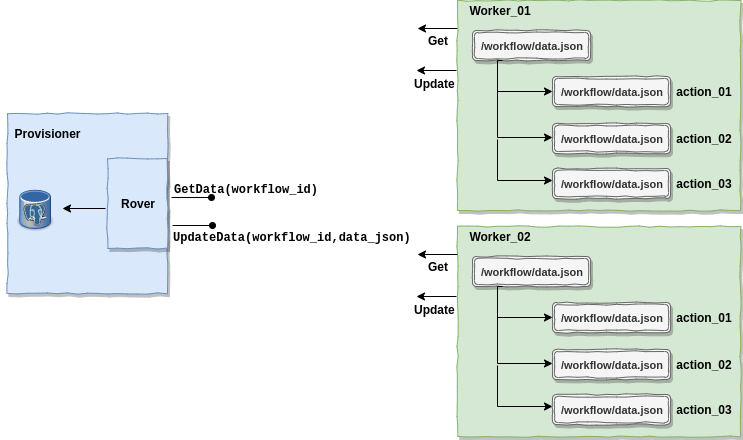

# Concepts

### Template

A template is a Go template based definition that defines the overall flow of a workflow. A user must write a template based on a valid template format. Template can consist of custom variable which can be substituted before execution. For example, a target is defined separately and is substituted in a template at the time of creating a workflow.

A template is stored as a blob in the database and is parsed later during the creation of a worflow. A user can CRUD a template using the CLI (`rover template`). Here is a sample workflow template: 

```yaml
version: '0.1'
name: ubuntu_provisioning
global_timeout: 6000
tasks:
- name: "os-installation"
  worker: "{{index .Targets "machine1" "mac_addr"}}"
  volumes:
    - /dev:/dev
    - /dev/console:/dev/console
    - /lib/firmware:/lib/firmware:ro
  environment:
    MIRROR_HOST: 192.168.1.2
  actions:
  - name: "disk-wipe"
    image: disk-wipe
    timeout: 90
  - name: "disk-partition"
    image: disk-partition
    timeout: 600
    environment:
       MIRROR_HOST: 192.168.1.3
    volumes:
      - /statedir:/statedir
  - name: "install-root-fs"
    image: install-root-fs
    timeout: 600
  - name: "install-grub"
    image: install-grub
    timeout: 600
    volumes:
      - /statedir:/statedir
```

A template comprises Tasks, which are executed in a sequential manner. A task can consits multiple Actions. As can be in the above example, a task supports volumes and environment variables. The volumes and environment variables defined for a particular task level are inherited by each action in that particular task. 

It is important to note that an action can also have its own volumes and environment variables. Therefore, any entry at an action will overwrite the value defined at the task level. For example, in the above template the `MIRROR_HOST` environment variable defined at action `disk-partition` will overwrite the value defined at task level. However, the other actions will receive the original value defined at the task level.


### Targets

Targets are mapping between the virtual worker name and the actual host. Currently we are refer targets with MAC or IP address. Here is a sample target definition:

```json
{
    "machine1":  {
        "ip_addr": "192.168.1.2"
    },
    "machine2" :  {
        "mac_addr": "ca:00:64:b8:2d:00"
    }
}
```

A target can be accessed in template like (refer above template):

```
{{ index .Targets "machine1" "ip_addr"}}
{{ index .Targets "machine2" "mac_addr"}}
```

### Provisioner

The provisioner machine is the main driver for executing a workflow. A provisioner houses the following components:
 - Database (Postgres)
 - Cacher (CLI and server)
 - Tinkerbell
 - Rover (CLI and server)
 - Hegel
 - Image Registry (optional)
 - Elasticsearch
 - Fluent Bit
 - Kibana
 - NGINX

It is upto you if you would like to divide these components into multiple servers.

### Worker

A node that has its data being pushed into Cacher can become a part of a workflow. A worker can be a part of multiple workflows. 

When the node boots, a worker container starts and connects with provisioner to check if there is any task (may be from different workflows) that it can execute. After the completion of an action, the worker sends action status to provisioner. When all workflows which are related to a worker are complete, a worker can terminate. 


### Ephemeral Data

The workers that are part of a workflow might require to share some data. This can take the form of a light JSON like below, or some binary files that other workers might require to complete their action. For instance, a worker may add the following data:

```json
 {"operating_system": "ubuntu_18_04", "mac_addr": "F5:C9:E2:99:BD:9B", "instance_id": "123e4567-e89b-12d3-a456-426655440000"}
```

The other worker may retrieve and use this data and eventually add some more:

```json
{"operating_system": "ubuntu_18_04", "mac_addr": "F5:C9:E2:99:BD:9B", "instance_id": "123e4567-e89b-12d3-a456-426655440000", "ip_addresses": [{"address_family": 4, "address": "172.27.0.23", "cidr": 31, "private": true}]}
```



